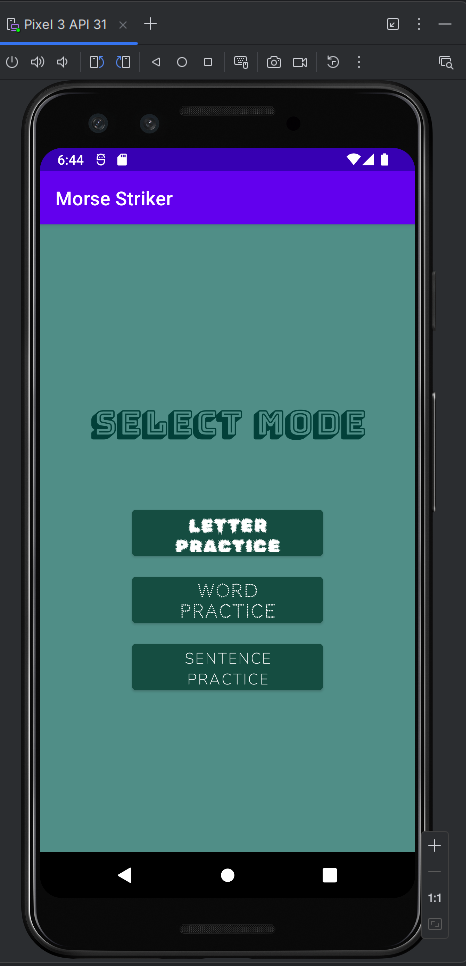
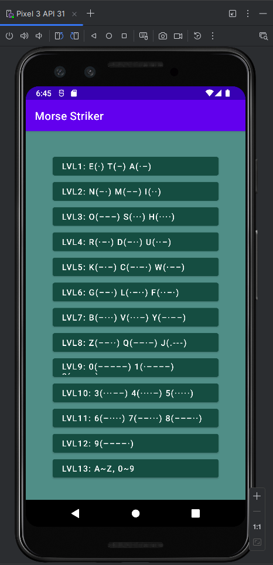
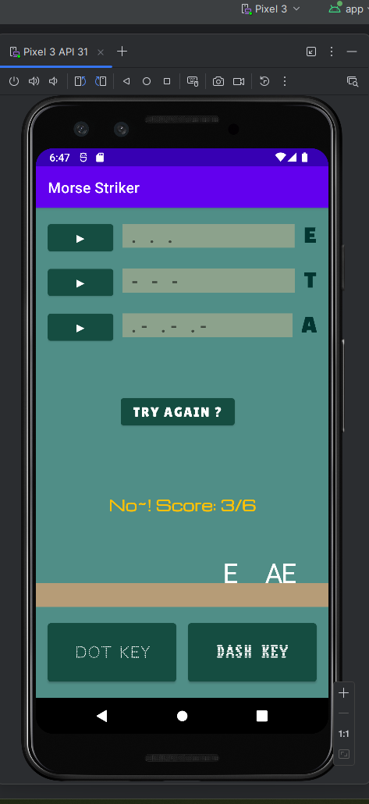

# MorseStriker

## A Morse Code Practice & Game Android App

**[▶ Download & Play MorseStriker](link)**

  &nbsp;&nbsp;&nbsp;&nbsp;
  &nbsp;&nbsp;&nbsp;&nbsp;
  

MorseStriker is an Android app that teaches and practices Morse Code through levels and a game-based practice system.

## Why I Started This Project

I first discovered Morse Code in middle school and thought it was interesting that people could communicate using a code made of just dots and dashes. I started learning it on my own and knew it well enough to use it.

In 10th grade, I took AP Java. During the summer, I started building a Morse Code practice app and also earned my FCC Amateur Radio Technician Class License.

I used several Morse Code learning apps for market research, but had a hard time finding one that used game elements in a fun way. That led me to build my own.

## How It Works

I divided Morse Code practice into three stages: Letter → Word → Sentence. The Letter and Word stages include games.

### 1. Letter

Learn and practice the Morse Code for individual letters.

| **Letter** | **Morse Code** |
| ---------- | -------------- |
| A          | .-             |
| B          | -...           |

After learning, the Letter Game lets you practice the letters.

### 2. Word

Learn short words and basic Morse Code expressions used in Amateur Radio.

| **Word** | **Morse Code** |
| -------- | -------------- |
| HI       | .... ..        |
| TNX      | - -. -..-      |

After learning, the Word Game lets you practice the words.

### 3. Sentence

The Sentence stage is included, but the game for this stage has not been implemented yet.

## Game

* Letters, words, or sentences fall from the top of the screen.
* Enter Morse Code using the Dot (`.`) and Dash (`-`) buttons.
* **You have to enter the correct answer before the letter, word, or sentence reaches the bottom of the screen. Correct answers increase the score.**
* A "Yay!" cheering sound plays when you get the answer right.
* The final score is shown when the game ends.

## Audio

I created the Morse Code sounds directly in the app.

* Different lengths for Dots and Dashes
* Consistent timing between Morse Code signals
* Morse Code can be played directly on the learning screens
* A sound effect plays for correct answers during the game

## Technologies

* Java
* Android Studio
* Android SDK
* XML
* `AudioTrack`
* `MediaPlayer`

## Source Code

The source code is organized into several main parts:

| **File**                        | **Description**                      |
| ------------------------------- | ------------------------------------ |
| `LetterPracticeActivity.java`   | Letter learning and Letter Game      |
| `WordPracticeActivity.java`     | Word learning and Word Game          |
| `SentencePracticeActivity.java` | Sentence learning and Sentence Game  |
| `KeyPracticeGame.java`          | Falling game logic                   |
| `PracticeData.java`             | Morse Code learning data             |
| `MorseSoundPlayer.java`         | Generates and plays Morse Code audio |
| `AppSoundPlayer.java`           | Plays game sound effects             |
| `ModeSelectActivity.java`       | Selects the learning stage           |
| `BaseActivity.java`             | Common screen setup                  |

## What I Learned

I learned that turning an idea into an actual app required much more research and planning than I expected. I needed to understand the perspective of users who did not know Morse Code, as well as the technical details. For example, Morse Code has specific timing rules: a dot is about 1 unit (60 ms), a dash is 3 units, the space between letters is 3 units, and the space between words is 7 units.

The app did not require complicated algorithms, but I spent a lot of time making the screens simple and easy to use, because I realized that it is the most important part.

The game idea came from a Hangul typing game I used in second grade. I remembered typing the falling letters as quickly as I could before they reached the bottom. It was exciting to see an idea from my childhood become something I could actually build.

I want to finish the Sentence stage and release the app on Google Play.

